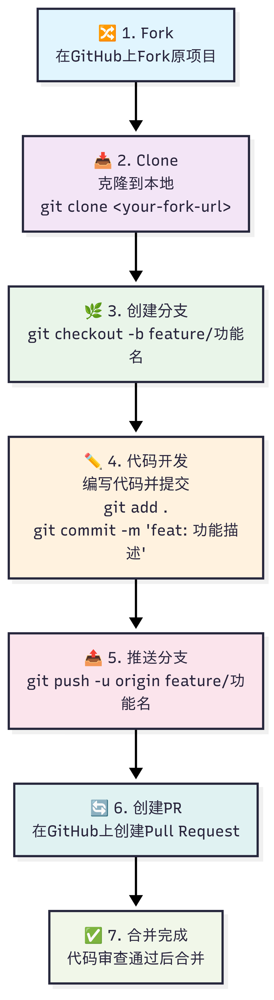
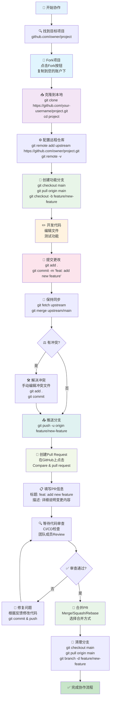

# GitHub 协作完整流程图

本文档提供了从 Fork 到 Pull Request 的完整 GitHub 协作流程，适用于开源项目贡献和团队协作开发。

## 🎯 流程概览

<div align="center">
  
  <br>
  <em>GitHub协作完整流程图</em>
</div>

> **💡 生成图片方法：**
> 1. 访问 [mermaid.live](https://mermaid.live)
> 2. 复制下方Mermaid代码
> 3. 导出为PNG格式并保存为 `main.png`

<details>
<summary>点击展开 Mermaid 源代码</summary>


</details>

## 📋 详细步骤说明

### 1. 🔍 项目发现与选择
- 在 GitHub 上找到您想要贡献的项目
- 阅读项目的 README 和贡献指南
- 检查项目的许可证和活跃度

### 2. 🔀 Fork 项目
```bash
# 在项目页面点击 "Fork" 按钮
# 项目将被复制到您的 GitHub 账户下
# 新的仓库地址: https://github.com/your-username/project-name
```

### 3. 📥 克隆到本地
```bash
# 克隆您 Fork 的仓库
git clone https://github.com/your-username/project-name.git
cd project-name

# 检查远程仓库配置
git remote -v
```

### 4. ⚙️ 配置上游仓库
```bash
# 添加原项目作为上游仓库
git remote add upstream https://github.com/original-owner/project-name.git

# 验证配置
git remote -v
# origin    https://github.com/your-username/project-name.git (fetch)
# origin    https://github.com/your-username/project-name.git (push)
# upstream  https://github.com/original-owner/project-name.git (fetch)
# upstream  https://github.com/original-owner/project-name.git (push)
```

### 5. 🌿 创建功能分支
```bash
# 确保在主分支上
git checkout main

# 拉取最新代码
git pull origin main

# 创建并切换到功能分支
git checkout -b feature/your-feature-name

# 分支命名规范：
# feature/功能名称  - 新功能开发
# bugfix/问题描述  - 错误修复
# hotfix/紧急修复  - 紧急问题修复
```

### 6. ✏️ 代码开发
```bash
# 进行代码开发
# - 编写新功能代码
# - 修复bugs
# - 更新文档
# - 编写测试用例

# 定期检查代码状态
git status
git diff
```

### 7. 📝 提交更改
```bash
# 添加文件到暂存区
git add .
# 或者选择性添加
git add specific-file.js

# 提交更改（使用语义化提交信息）
git commit -m "feat: add user authentication feature

- Implement login/logout functionality
- Add password validation
- Update user interface components"

# 提交信息格式：
# feat: 新功能
# fix: 错误修复
# docs: 文档更新
# style: 代码格式
# refactor: 重构
# test: 测试相关
```

### 8. 🔄 保持同步
```bash
# 获取上游仓库的最新更改
git fetch upstream

# 合并上游更改到当前分支
git merge upstream/main

# 如果有冲突，手动解决后：
git add .
git commit -m "resolve merge conflicts"
```

### 9. 📤 推送分支
```bash
# 首次推送分支
git push -u origin feature/your-feature-name

# 后续推送
git push
```

### 10. 🔄 创建 Pull Request
在 GitHub 网页上：
1. 访问您的 Fork 仓库
2. 点击 "Compare & pull request" 按钮
3. 选择正确的分支：
   - base: `original-repo:main`
   - compare: `your-fork:feature/your-feature-name`

### 11. 📋 填写 PR 信息
```markdown
## 🎯 变更内容
简要描述这个 PR 解决了什么问题或添加了什么功能。

## 🛠️ 实现方案
- 列出主要的技术实现
- 说明重要的设计决策

## 🧪 测试
- [x] 单元测试已通过
- [x] 集成测试已完成
- [x] 手动测试已验证

## 📋 检查清单
- [x] 代码遵循项目规范
- [x] 添加了必要的注释
- [x] 更新了相关文档
- [x] 没有破坏现有功能

## 🔗 相关链接
- 关联 Issue: #123
```

### 12. 🔍 代码审查流程
- **自动检查**：CI/CD 系统运行测试
- **人工审查**：团队成员检查代码质量
- **反馈处理**：根据评论修改代码
- **再次推送**：更新 PR 内容

### 13. 🔧 处理审查反馈
```bash
# 根据反馈修改代码
# ... 编辑文件 ...

# 提交修改
git add .
git commit -m "fix: address review comments

- Fix validation logic
- Improve error handling
- Add unit tests"

# 推送更新
git push
```

### 14. 🎉 PR 合并
项目维护者选择合并方式：
- **Merge commit**：保留完整提交历史
- **Squash and merge**：压缩为单个提交
- **Rebase and merge**：创建线性历史

### 15. 🧹 清理工作
```bash
# 切换回主分支
git checkout main

# 拉取最新代码（包含您的更改）
git pull origin main

# 删除本地功能分支
git branch -d feature/your-feature-name

# 删除远程分支（可选）
git push origin --delete feature/your-feature-name
```

## ⚠️ 常见问题和解决方案

### Q1: 如何解决合并冲突？
```bash
# 1. 获取最新的上游更改
git fetch upstream
git merge upstream/main

# 2. 手动编辑冲突文件
# 查找并解决 <<<<<<< HEAD 标记的冲突

# 3. 标记冲突已解决
git add .
git commit -m "resolve merge conflicts"
```

### Q2: PR 被拒绝怎么办？
- 仔细阅读拒绝原因
- 根据反馈修改代码
- 重新提交并更新 PR
- 必要时在 PR 中留言说明修改内容

### Q3: 如何保持 Fork 与原项目同步？
```bash
# 定期同步（建议每周执行一次）
git checkout main
git fetch upstream
git merge upstream/main
git push origin main
```

## 🎯 最佳实践

### 1. 提交信息规范
- 使用清晰的提交信息
- 遵循团队的提交规范
- 每个提交只做一件事

### 2. 分支管理
- 及时删除已合并的分支
- 使用描述性的分支名称
- 保持分支的原子性

### 3. 代码质量
- 编写测试用例
- 遵循代码规范
- 添加必要的注释

### 4. 协作沟通
- 及时响应审查反馈
- 在 PR 中详细说明变更
- 保持友好的沟通态度

## 📚 相关资源

- [GitHub官方文档](https://docs.github.com/)
- [Git命令参考](./resources/git-commands-reference.md)
- [代码审查清单](./resources/code-review-checklist.md)
- [提交信息指南](./resources/commit-guide.md)

---

*最后更新：2025年1月* 